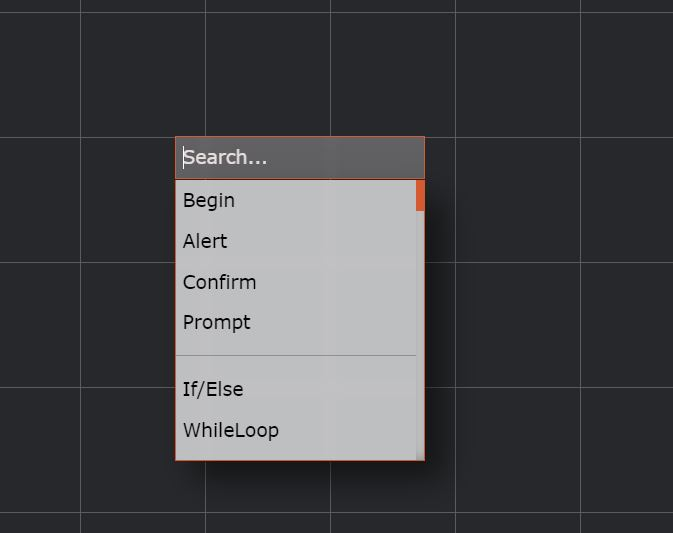
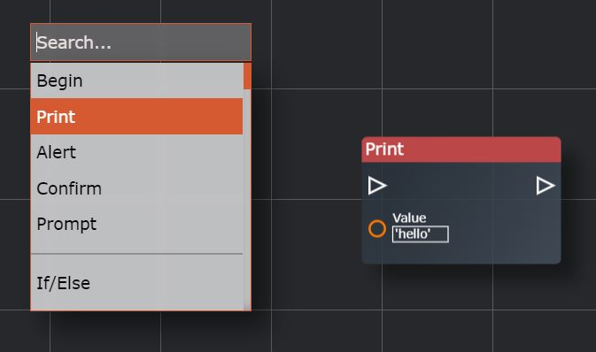
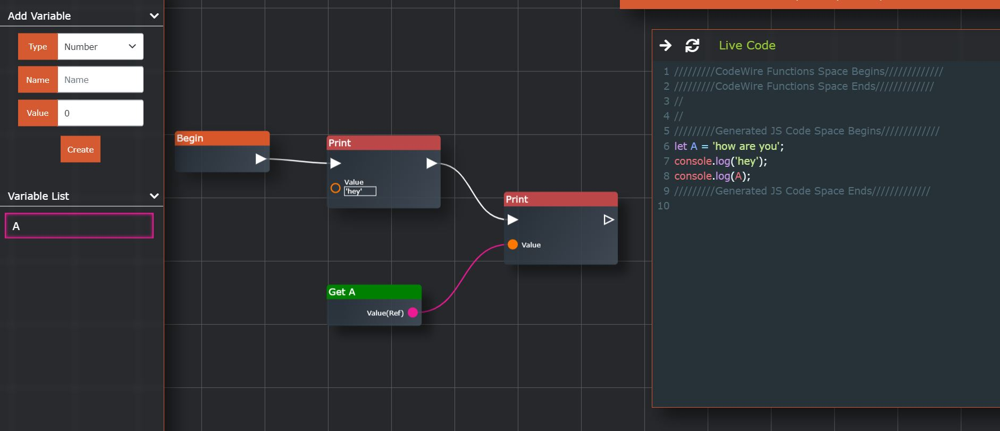
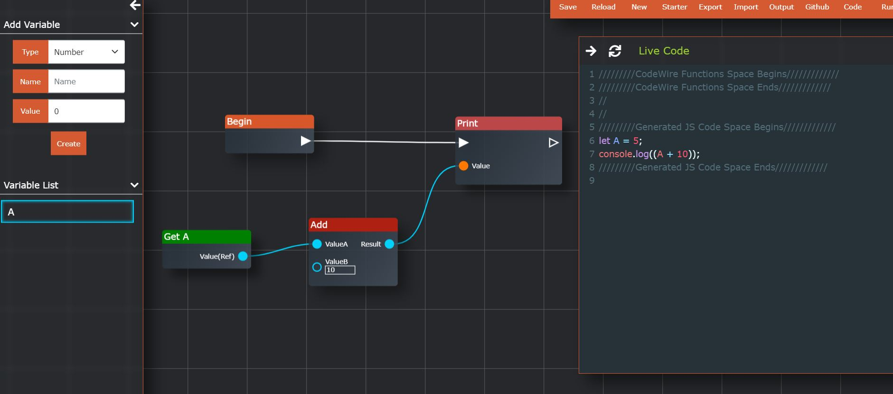

# CodeWire


Try at https://ayushk7.github.io/CodeWire/
CodeWire is a node based editor inspired by UE4 Blueprints which helps in better visualization of the code,
and faster scripting of complex and repetitive tasks.
It doesn't bind to any particular language.
Multiple target languages can be added to added in the future.

Tutorial:
1. Include Begin Node By Right Click And Select Begin.
2. Include Other Nodes In The Same Way.
3. Use Left Panel To create New Variable.
4. New variable is added into the right click menu, or you can drag it from the variable panel.
5. Hold middle mouse button To Pan.
6. Use Scroll Wheel To Zoom in and out.
7. Hold left Ctrl and click the node or the wire to delete it or simply right and select delete.
9. White wire between two arrow terminals is used for execution flow.
10. Colored wire is used for input/outputs.
11. Click Code to get Javascript native code.

# Screenshots

## Fibonacci Series


## HTTP REQUEST/Compiled Code


This project is still in under development,
subsequent new features like functions, delay, sand boxing, save, undo will be added.

## Contributing

Join Discord Server https://discord.gg/VuB2UjzqrK
Thanks @L-o-o-t for creating the server

### Anatomy Of Nodes


### Adding New JS Nodes
1. Add the description of node in the [javascript/Nodes/nodes.js](javascript/Nodes/nodes.js)
```js
    //description of the Print node
        if (type == 'Print') {
            nodeDescription.nodeTitle = 'Print';
            nodeDescription.execIn = true;
            nodeDescription.pinExecInId = null;
            nodeDescription.execOut = {
                execOut0: {
                    execOutTitle: null,
                    pinExecOutId: null,
                    outOrder: 0,
                },
            }
            nodeDescription.inputs = {
                input0: {
                    inputTitle: 'Value',
                    dataType: 'Data',
                    defValue: "'hello'",
                    pinInId: null,
                }
            }
            // styling for the node
            nodeDescription.color = 'Print';
            nodeDescription.rows = 3;
            nodeDescription.colums = 12;
        }

        //NOTE: this same object is furthur used for serialization and deserialization of the graph, so we have some meta info like pinIds
```
<b>But still the node is not available in the context menu</b>



2. To make this node available in the context menu you need to add it to the markup in [index.html](index.html)
```html
<div class="context-menu-items">Begin</div>
<div class="context-menu-items">Print</div>  <!-- this is the title of the newly added node -->
<div class="context-menu-items">Alert</div>
<div class="context-menu-items">Confirm</div>
```
<b>Result</b>


3. Now only thing left is to add the logic for the node, that is what code it should generate on it's turn

For this you need add the logic in [VisualScriptToJavascript.js](javascript/VisualScriptToJavascript/VisualScriptToJavascript.js) in <b>coreAlgorithm(node)</b> method

```js
    case "Print": {
        this.script += `console.log(${this.handleInp(inputPins[0])});\n
         `;
        this.coreAlgorithm(execOutPins[0]); // this tells algo to go to the next node which is connected at first pin(triangle shaped)
    }

    // this will append the console.log(input) in the generated js
```
<b>Result</b>



#### NOTE: The above node only takes input, but if the node also do outputs, then that logic is needed to be added separately
Example: Add Node

Description:
```js
    if (type == 'Add') {   // this type should match the entry in the context menu's markup in index.html
        nodeDescription.nodeTitle = 'Add';
        nodeDescription.inputs = {
            input0: {
                inputTitle: 'ValueA',
                dataType: 'Number',
                defValue: 0,
                pinInId: null,
            },
            input1: {
                inputTitle: 'ValueB',
                dataType: 'Number',
                defValue: 0,
                pinInId: null,
            }
        }
        nodeDescription.outputs = {
            output0: {
                outputTitle: 'Result',
                dataType: 'Number',
                pinOutId: null,
                outOrder: 0,
            }
        }
        nodeDescription.color = 'Math';
        nodeDescription.rows = 2;
        nodeDescription.colums = 10;
    }
```

And In [VisualScriptToJavascript.js](javascript/VisualScriptToJavascript/VisualScriptToJavascript.js)

in <b>handleInputs()</b> method

```js
case "Add": {
    expr = `(${this.handleInputs(inputPins[0])} + ${this.handleInputs(inputPins[1])})`;
}
// this will generate and return (inp1 + inp2) expression
```



#### GOALS
1. Add support for functions
2. Add support for custom modules
3. Make it available in VSCode as an extension
4. Add support for multiple target languages to compile the graph to(for example python, C++ etc)

<i> These goals are ordered based on the priority </i>


