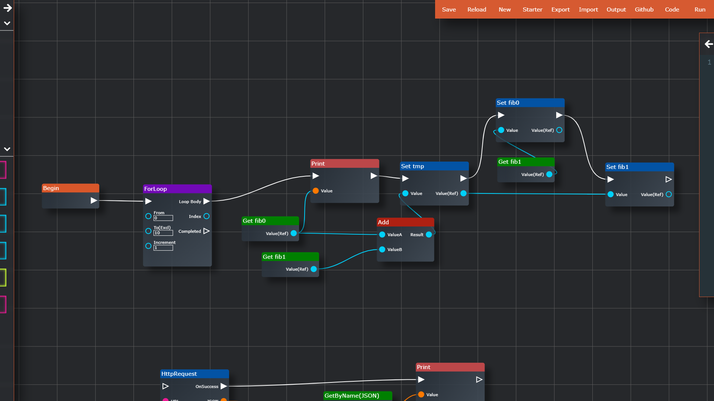
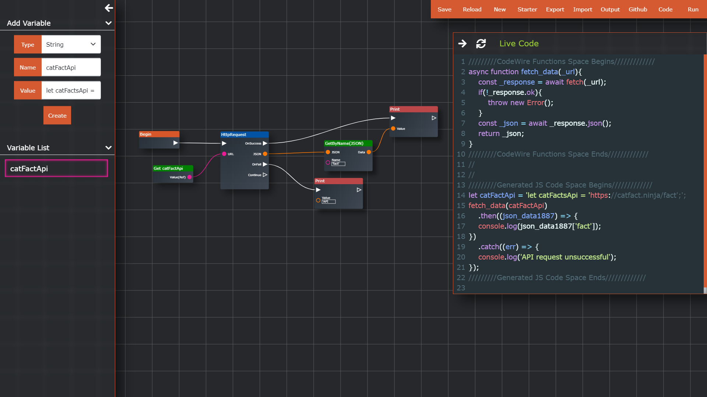

# CodeWire

  

Try at https://ayushk7.github.io/CodeWire/

**Run locally:** From the repo root run `npm start`. The app is served from the `src/` directory (default http://localhost:3000).

CodeWire is a node based editor inspired by UE4 Blueprints which helps in better visualization of the code,
and faster scripting of complex and repetitive tasks.
It doesn't bind to any particular language.
Multiple target languages can be added to added in the future.

Tutorial:
1. Include Begin Node By Right Click And Select Begin.
2. Include Other Nodes In The Same Way.
3. Use Left Panel To create New Variable.
4. New variable is added into the right click menu, or you can drag it from the variable panel.
5. Hold middle mouse button To Pan.
6. Use Scroll Wheel To Zoom in and out.
7. Hold left Ctrl and click the node or the wire to delete it or simply right and select delete.
9. White wire between two arrow terminals is used for execution flow.
10. Colored wire is used for input/outputs.
11. Click Code to get Javascript native code.

# Screenshots

## Fibonacci Series

## HTTP REQUEST/Compiled Code

## Documentation

### Node Anatomy

### Adding New Nodes

With the node registry, adding a new node only requires editing one file: [src/js/registry/nodeDefinitions.js](src/js/registry/nodeDefinitions.js).

1. Call `registerNode({ id, schema, execCodegen?, exprCodegen? })` with the node's schema (inputs, outputs, exec pins, color, rows, columns).
2. Add the node id to the `registerMenuOrder()` array at the bottom of the file (use `null` for a separator).
3. If the node has execution flow, provide an `execCodegen(compiler, node)` function.
4. If the node produces an expression output, provide an `exprCodegen(compiler, inputNode)` function.

See existing definitions in [src/js/registry/nodeDefinitions.js](src/js/registry/nodeDefinitions.js) for examples (e.g. Print, Add, Branch).

The node factory ([src/js/nodes/nodeFactory.js](src/js/nodes/nodeFactory.js)) and compiler ([src/js/compiler/compiler.js](src/js/compiler/compiler.js)) automatically pick up any registered node.

